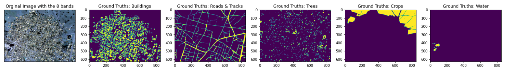
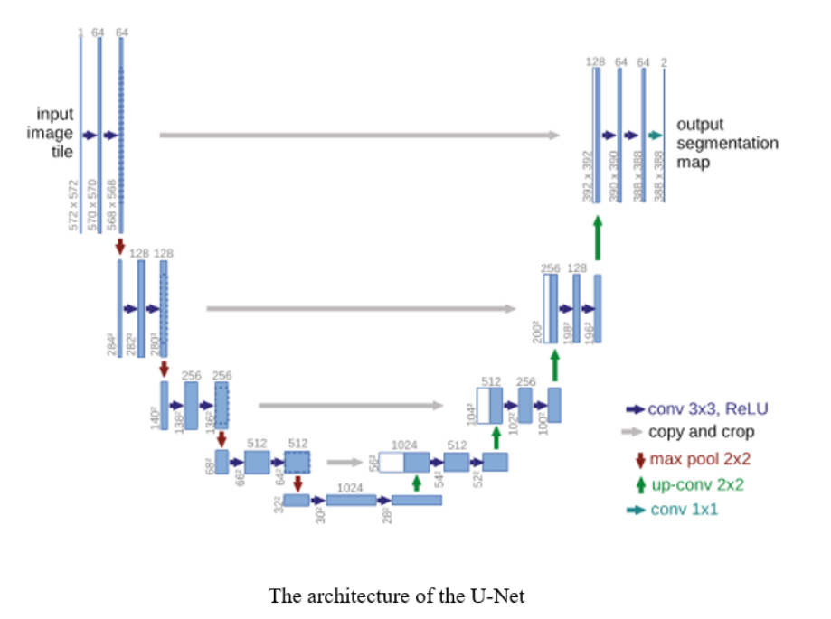

# Counting Trees through Satellite Images

## 1. Introduction:

Counting trees manually from satellite images above is a very tedious task. Fortunately, there are several techniques for automating tree counting. Morphological operations and classical segmentation algorithms like the watershed algorithm have been applied to tree counting with limited success so far. However, in case of dense areas, the trees are more densely packed and the crowns of the tress often overlap. These areas probably show different forest characteristics, such as differences in crown structure, species diversity, openness of tree crowns. This makes the problem more difficult. Therefore the tree counting algorithm has to be more robust and intelligent. This is where deep learning comes into play.

**This study investigates the aspect of <b> localizing and counting trees </b> to create an inventory of incoming and outgoing trees that may not be able to be documented and recorded in the tree register during the annual tree inspections due to extensive felling or other reasons.**

## 2. Dataset and Processing:

Satellite images are usually very large and have more than three channels. Our dataset  consist of satellite images (848 × 837 pixels and eight channel) and labeled masks ( has 848 × 837 pixels and five channel) which are hand label by the analysts with image labeling tools to present:

<b>
  
1. Buildings
  
2. Roads and Tracks

3. Tress

4. Crops

5. Water
</b>

Below you see one of the satellite images and the corresponding labels:

  
 

**In order to create training  and validation  dataset, the steps below were implemented:**

1. When reading the satellie images and it's corresponding lables,  20 percent of each image and label was assigned  to the evaluation data set.
2. Once the training dataset and the validation dataset are created, a random window with a predefined size moves over the images and labels of the training dataset and the validation dataset to create the predefined number of patches.  For example, with a window size of 160 and 4000 patches for the training data set, we have a shape of (4000, 160,  160, 8) for the training images and a shape of (4000, 160, 160, 5) for the training labels.
3. Since we will focus on counting the trees in this study, the four other channels of labels, namely buildings, roads and tracks, crops and water will be removed. i.e., the shape of the training labels(4000, 160, 160, 5) explained above will be (4000, 160, 160, 1).

## 3. Models

There are various deep learning segmentation methods like [Semantic Segmentation](https://medium.com/analytics-vidhya/deep-learning-semantic-segmentation-networks-18148e2cf0fb) and [Instance Segmentation](https://medium.com/analytics-vidhya/deep-learning-instance-segmentation-networks-2aa71c920b5b), each of which has leading models.  In this phase of the study we decieded for the U-net which has attracted many attentions in the last few years and uses fully convolutional networks to perform the task of **Semantic segmentation**.

The first U-Net was built by Olaf Ranneberger et al. at the University of Freiburg for the segmentation of biomedical images . Then, it was used in many other architectures like Pix2Pix network to solve challenging problems.  As seen below, the architecture of the U-Net looks like a ‘U’, which acknowledges its name. 

  
 

Furthermore, this architecture consists of two sections, including: 

1. The contraction section which is used to capture the context in the image and increase “What”(Semantic) and decrease “Where”(Spatial).

2. The expansion section that enables precise localization.

**After [implementing the U-net model](https://github.com/A2Amir/Counting-Trees-through-Satellite-Images/blob/main/unet_model.py) explained above, we should choose a loss function and valuation metrics to evaluate the model during training.**

## 4. Loss function and Evaluation Metrics:

